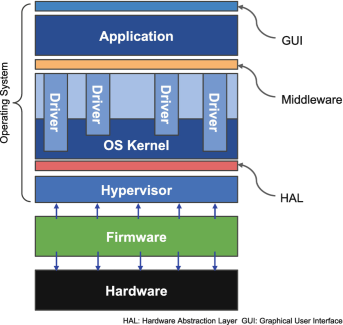

# 1 - Softwaren i en computer

- ***firmware*** : brohoved mellem hardware og traditionel software - BIOS basic input/output & UEFI unified extensible firmware interface
- ***operativ system*** : brohoved mellem hardware og de øvre lag af software. Den administrerer hardware igennem drivere, og anmoder om ressourcer til at udføre opgaver. Indeholder også ofte en brugergrænseflade
- ***drivere*** : programmer til kommunikation imellem enkelte hardware og os
- ***middleware*** : brohoved (ofte api'er ) imellem applikations software og 
- ***application software*** : programmer der løser specikke opgaver -word, maple, minecraft osv.