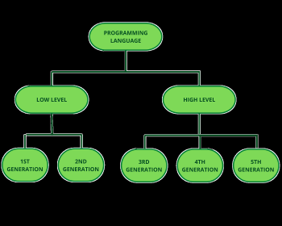

# 2 - Sprog generationer

- ***1.GL*** : maskinkode
- ***2.GL*** : assembly, anvender assembler til at bygge maskinkoden 
- ***3.GL*** : høj-niveau, anvender kompiler til at bygge den "eksekverbare fil"
- ***4.GL*** : højere abstraktion af høj-niveau, "hvad" skal der gøres istedet for "hvordan" (sql)
- ***5.GL*** : problemløsning vha grænser og regler (almindeligt sprog, prolog)