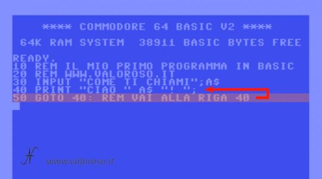

# 3 - Sprogets opbygning

Et almindeligt højniveausprog består af følgende dele:

- Variabler - lagerplads
- Datatyper - variablens type af data 
- Operators - aritmetiske, logiske og sammenligning
- Kontrolstrukturer - forgrening af kode ,- goto ( er også forgrening)
- Funktioner/subrutiner/metoder 
